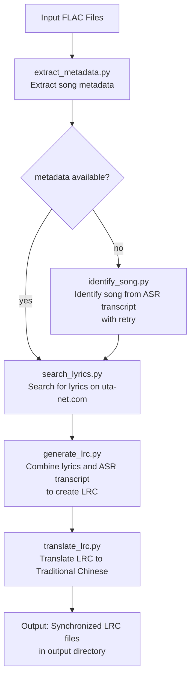

# Architecture: Music Lyrics Processing Pipeline

## System Architecture

Modular pipeline architecture with independent components that can run standalone or as part of the full workflow.

### Pipeline Flow



### Core Components

#### Metadata Extraction (`extract_metadata.py`)
- Extracts song metadata using mutagen library
- Supports multiple audio formats with fallback to filename parsing

#### Song Identification (`identify_song.py`)
- Identifies songs from ASR transcripts using LLM and web search
- Includes retry mechanism and caching system

#### Lyrics Search (`search_lyrics.py`)
- Scrapes lyrics from uta-net.com using song title and artist
- Handles rate limiting and proper formatting

#### Vocal Separation (`separate_vocals.py`)
- Separates vocals from music using UVR models
- CPU-based processing with custom output paths

#### Transcription (`transcribe_vocals.py`)
- Generates timestamped transcription using faster-whisper
- Word-level timestamps for accurate alignment

#### LRC Generation (`generate_lrc.py`)
- Combines lyrics and timestamps to create synchronized LRC files
- Uses LLM for intelligent alignment

#### Translation (`translate_lrc.py`)
- Translates LRC lyrics to Traditional Chinese
- Preserves timestamps and formatting

#### Batch Processing (`process_lyrics.py`)
- Orchestrates full workflow with progress tracking
- Includes retry mechanisms

### Data Flow Architecture

#### File Path Management (`utils.py`)
- `find_flac_files()`: Recursively discovers FLAC files
- `get_output_paths()`: Maps input files to all intermediate/output paths
- `ensure_output_directory()`: Creates necessary directories

#### Output Directory Structure
```
tmp/ (temporary files)
└── {relative_path}/
    └── {filename}/ (song-specific folder)
        ├── {filename}_(Vocals)_UVR_MDXNET_Main.wav (separated vocals)
        ├── {filename}_(Vocals)_UVR_MDXNET_Main_transcript.txt (ASR transcript)
        ├── {filename}_lyrics.txt (downloaded lyrics)
        └── {filename}.lrc (generated LRC)
output/ (final files)
└── {relative_path}/
    └── {filename}.lrc (translated bilingual LRC)
```

### Technical Architecture

#### Configuration Management
- Environment variables for API configuration (OPENAI_API_KEY, OPENAI_BASE_URL, OPENAI_MODEL)
- Support for custom base URLs for OpenAI-compatible services
- Logging configuration through centralized module

#### Logging Architecture (`logging_config.py`)
- Centralized logging configuration across all modules
- Consistent format and level management
- Support for both console and file logging
- UTF-8 encoding for international characters

#### Error Handling
- Comprehensive exception handling in each module
- Graceful degradation when components fail
- Detailed logging of errors and warnings
- Validation of inputs and outputs

### API Integration Architecture

The system uses OpenAI-compatible APIs for both LRC generation and translation:
- Custom base URL support for alternative providers
- Model selection through environment variables
- Structured prompting for consistent outputs
- Error handling for API failures

### Processing Pipeline Architecture

The system supports both component-level and full-pipeline processing:
- Individual scripts can be run standalone
- Main orchestrator (`main.py`) coordinates components
- Batch processor (`process_lyrics.py`) handles multiple files
- Checkpoint-based processing (skips completed steps when possible)

### Documentation Architecture

The project implements a centralized documentation architecture optimized for AI maintenance:

#### Documentation Structure
```
docs/
├── README.md (main project documentation)
├── modules/ (individual module documentation)
└── guides/ (future development guides)
```

#### Code Documentation Approach
- **Minimal Reference-Style Docstrings**: Clean, focused code files (~50 lines each)
- **Centralized Module Documentation**: Comprehensive markdown files (~400 lines each)
- **Cross-Referenced Architecture**: Documentation links between related modules
- **AI-Optimized Structure**: Efficient for automated maintenance and context window management
- **Chart Format**: Use Mermaid for all charts and diagrams in this project