# LyricSync AI

🎵 **AI-Powered Lyrics Processing** → 🎤 **Vocal Separation** → 🔍 **Song Identification** → 📝 **Synchronized LRC**

This project provides a comprehensive pipeline for processing music files to extract lyrics, separate vocals, and generate synchronized LRC format lyrics with translation capabilities.

## 🚀 Project Summary

| **Input** | **Process** | **Output** |
|-----------|-------------|------------|
| Audio files (FLAC/MP3) | AI separates vocals → transcribes → identifies songs → finds lyrics → syncs timestamps | Bilingual LRC files (Original + Traditional Chinese) |

**Key Innovation**: LLM-powered song identification from ASR transcripts enables processing of files without metadata, with retry logic for accuracy.

## Features

- **Metadata Extraction**: Extract song title, artist, and other metadata from audio files
- **Song Identification**: Identify songs from ASR transcripts using LLM and web search (with retry)
- **Lyrics Search**: Search for lyrics on uta-net.com using song title and artist
- **Vocal Separation**: Separate vocals from music using audio-separator
- **Transcription**: Generate timestamped transcription of vocals using Whisper
- **LRC Generation**: Combine verified lyrics and transcription to create synchronized LRC files
- **Translation**: Translate LRC lyrics to Traditional Chinese (or other languages)

## Pipeline Workflow

```mermaid
graph TD
    A[🎵 Input Audio Files]
    B[🎵 EXTRACT METADATA<br>Read metadata from file<br>Fallback to filename parsing if needed]
    A --> B
    C[🎤 SEPARATE VOCALS & TRANSCRIBE<br>Use UVR to isolate vocals from music<br>Generate timestamped ASR transcription]
    B --> C
    D[🔍 IDENTIFY SONG & SEARCH LYRICS<br>Use LLM + web search mcp to <br>1.Idenify song name and artist if no metadata was found<br>2.Download and parse lyrics text]
    C --> D
    E[🎼 GENERATE LRC FILE<br>Use LLM to combine verified lyrics + ASR timestamps<br>Create synchronized mm:ss.xx format<br>Ensure proper timing alignment]
    D --> E
    F[🌏 TRANSLATE LYRICS<br>Use LLM to convert lyrics while preserving timestamps<br>Create bilingual LRC file<br>Maintain original + translated text]
    E --> F
    G[🎯 OUTPUT: Synchronized Bilingual LRC Files]
    F --> G
```



### Workflow Details

1. **🎵 Input Processing**: Audio files (FLAC/MP3) are processed recursively from input directory
2. **📋 Metadata Extraction**: Song title, artist, and other metadata extracted from audio tags
3. **🔍 Identify Song & Search Lyrics**: If no metadata, use LLM to identify song; search for lyrics using web-search-mcp
4. **🎤 Separate Vocals & Transcribe**: Use UVR to isolate vocals, generate timestamped ASR transcription
5. **🎼 LRC Generation**: Creates synchronized LRC file combining lyrics + ASR timestamps
6. **🌏 Translation**: Translates LRC to target language while preserving timestamps
7. **🎯 Output**: Saves synchronized bilingual LRC files to output directory

### Quality Assurance Features

- ✅ **Retry Logic**: Song identification retries up to 3 times with feedback
- ✅ **Fallback Mechanisms**: Multiple strategies for handling missing metadata
- ✅ **Error Handling**: Graceful degradation if any step fails
- ✅ **Progress Tracking**: Detailed logging and CSV output for batch processing

## Quick Start Guide

### 🎯 One-Command Setup
```bash
# 1. Clone and setup
git clone <repository-url>
cd lyric_gen
uv sync

# 2. Configure API (create .env file)
echo "OPENAI_API_KEY=your_key_here" > .env
echo "OPENAI_BASE_URL=https://api-inference.modelscope.cn/v1" >> .env

# 3. Process your music files
uv run process_lyrics.py input/ --resume
```

### 📋 What Happens
1. **Auto-detects** all audio files in `input/` folder
2. **Extracts** song metadata (title, artist) from audio tags
3. **Identifies** songs and searches for lyrics (AI-powered if metadata missing)
4. **Separates** vocals and generates timestamped transcription
5. **Creates** synchronized LRC files with timestamps
6. **Translates** to Target language

### 🎵 Input/Output Example


## Installation

1. Clone the repository:
```bash
git clone <repository-url>
cd lyric_gen
```

2. Install dependencies using uv:
```bash
uv sync
```

3. Set up environment variables by creating a `.env` file:
```env
OPENAI_API_KEY=your_api_key_here
OPENAI_BASE_URL=https://api-inference.modelscope.cn/v1
OPENAI_MODEL=Qwen/Qwen3-235B-A22B-Instruct-2507
```

## Usage

### Quick Start

Run the main pipeline with default settings:
```bash
uv run process_lyrics.py
```

### Individual Components

Each pipeline component can be run independently:

```bash
# Extract metadata from an audio file
uv run extract_metadata.py input/your_song.flac

# Search for lyrics online
uv run search_lyrics.py input/your_song.flac

# Separate vocals and transcribe
uv run separate_vocals.py input/your_song.flac

# Generate LRC lyrics from transcript
uv run generate_lrc.py

# Translate LRC lyrics to Traditional Chinese
uv run translate_lrc.py input/your_song.lrc
```

### Individual Scripts

Each component can also be run directly:

```bash
# Extract metadata
uv run extract_metadata.py input/your_song.flac

# Debug metadata
uv run debug_metadata.py input/your_song.flac

# Search for lyrics
uv run search_lyrics.py input/your_song.flac

# Separate vocals
uv run separate_vocals.py input/your_song.flac

# Generate LRC lyrics
uv run generate_lrc.py

# Translate LRC lyrics
uv run translate_lrc.py input/your_song.lrc
```

## Configuration

### Logging

All scripts support configurable logging levels:
```bash
uv run extract_metadata.py input/your_song.flac --log-level DEBUG
```

### Output Directories

- Input files should be placed in the `input/` directory
- Output files are saved in the `output/` directory
- Models are stored in the `models/` directory

## Requirements

- Python 3.13+
- [uv](https://github.com/astral-sh/uv) for package management
- Required Python packages (see `pyproject.toml`)
- Audio files in common formats (FLAC, MP3, etc.)
- API key for OpenAI-compatible service for LRC generation and translation

## Troubleshooting

### Common Issues

1. **Missing Dependencies**: Ensure all dependencies are installed via uv with `uv sync`
2. **API Key Issues**: Verify your API keys are correctly set in the `.env` file
3. **File Not Found**: Ensure input files exist in the correct directory
4. **Model Issues**: Some models may need to be downloaded automatically on first use

### Troubleshooting

**Song Identification Issues**
- **Problem**: Cannot identify song from ASR transcript
- **Solution**: Ensure ASR transcript has sufficient content (at least a few sentences of lyrics)
- **Tip**: Check the transcript file in `tmp/` folder to see ASR quality

**Low Confidence Results**
- **Problem**: System returns low confidence matches
- **Solution**: This is normal for poor quality audio or very obscure songs
- **Tip**: Consider using higher quality audio files or checking if songs exist on uta-net.com

### Getting Help

- Check the `tmp/` folder for intermediate files (transcripts, lyrics) to debug issues
- Use `--log-level DEBUG` for detailed logging information
- All processing steps are logged with timestamps for troubleshooting

## Contributing

1. Fork the repository
2. Create a feature branch
3. Make your changes
4. Add tests if applicable
5. Submit a pull request