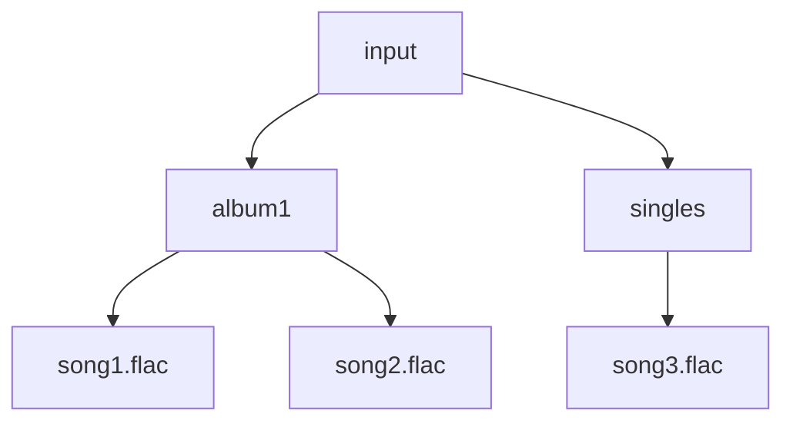
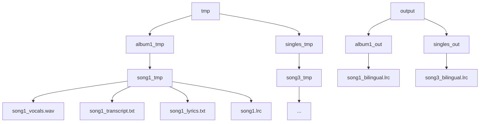

# Batch Processing Orchestrator

## ⚡ Complete Pipeline Orchestration (`process_lyrics.py`)

This module is the flagship component of the Music Lyrics Processing Pipeline, providing comprehensive batch processing capabilities for entire music libraries. It orchestrates the complete six-stage workflow across multiple files, with sophisticated progress tracking, resume functionality, and detailed reporting.

## Pipeline Integration

```mermaid
flowchart TD
    A[Music Library<br/>(multiple files)] --> B[process_lyrics<br/>(batch orchestrator)]
    B --> C[Synchronized LRC<br/>Files with Translation]
```

## Core Functionality

### Primary Purpose
- Orchestrate complete six-stage pipeline for multiple audio files
- Provide comprehensive batch processing with progress tracking
- Implement resume functionality for interrupted processing
- Generate detailed CSV reports with quality metrics

### Key Features
- **Complete Workflow**: Full six-stage pipeline orchestration
- **Recursive Discovery**: Find audio files in nested directory structures
- **Progress Tracking**: Real-time progress indicators and ETA
- **Resume Support**: Continue interrupted processing seamlessly
- **Error Recovery**: Continue processing other files if one fails
- **CSV Reporting**: Detailed processing results and quality metrics

## Complete Processing Workflow

### Stage 1: Metadata Extraction
**Purpose**: Extract song information from audio file tags
- Extract title, artist, album, genre, year, track number
- Fallback to filename parsing if no metadata exists
- Validate essential information for lyrics search
- Continue to vocal separation

### Stage 2: Vocal Separation
**Purpose**: Isolate vocals from background music using AI
- Use UVR model for high-quality vocal separation
- Save vocals in organized directory structure
- Automatic cleanup of instrumental files
- Continue to ASR transcription

### Stage 3: ASR Transcription
**Purpose**: Generate timestamped transcripts from isolated vocals
- Transcribe vocals with word-level timestamps
- Generate structured transcript file
- Support resume functionality (skip if exists)
- Continue to lyrics search

### Stage 4: Lyrics Search & Identification
**Purpose**: Find lyrics using metadata and ASR-based song identification
- Search uta-net.com using metadata
- Fallback to LLM-based song identification from ASR transcripts
- Use web search to identify unknown songs
- Continue to LRC generation

### Stage 5: LRC Generation
**Purpose**: Create synchronized LRC files from lyrics and timestamps
- Combine verified lyrics with ASR timestamps
- Use LLM for intelligent timing alignment
- Generate properly formatted LRC file
- Continue to translation

### Stage 6: Translation
**Purpose**: Add Traditional Chinese translation to LRC files
- Translate LRC to Traditional Chinese (bilingual output)
- Create synchronized bilingual lyrics
- Preserve timing and formatting
- Complete processing pipeline

## Batch Processing Architecture

### 1. Recursive File Discovery
- **Multi-Format Support**: Finds FLAC and MP3 files recursively
- **Structure Preservation**: Maintains folder hierarchy in output
- **Smart Filtering**: Identifies audio files by extension
- **Progress Reporting**: Shows discovery results and counts

### 2. Progress Tracking System
- **Real-Time Updates**: Current file being processed
- **Completion Indicators**: Progress percentage and file counts
- **Success Metrics**: Success/failure counting and reporting
- **ETA Calculations**: Estimated time for large batches

### 3. Resume Functionality
- **Checkpoint Detection**: Identifies completed processing stages
- **Skip Logic**: Avoids redundant operations on completed files
- **Partial Resume**: Continues from last completed stage
- **Cache Management**: Preserves intermediate results

### 4. Error Recovery Strategy
- **Individual File Isolation**: One file failure doesn't stop batch
- **Detailed Error Logging**: Comprehensive error reporting
- **Graceful Degradation**: Continues processing other files
- **Result Aggregation**: Collects results from all files

## Directory Structure Management

### Input Structure


### Processing Structure


## Processing Results System

### Per-File Results Tracking
**Comprehensive Metrics:**
- Success/failure status for each processing stage
- Processing times and file sizes
- Error messages and debugging information
- Quality metrics and validation results

**CSV Export Columns:**
- File information (name, path, timestamps)
- Metadata extraction results (title, artist, album, etc.)
- Audio processing metrics (vocal separation, transcription)
- Quality assurance results (lyrics search success, LRC generation)
- Error reporting and troubleshooting data

### Progress Monitoring
**Real-Time Feedback:**
- Current file being processed with progress indicator
- Completion percentage and ETA calculations
- Success/failure counts and statistics
- Performance metrics and timing information

## Resume Capabilities

### Smart Checkpoint System
1. **Completion Detection**:
   - Checks for existing output files
   - Validates file modification times
   - Determines processing stage completion

2. **Partial Resume**:
   - Continues from last completed stage
   - Preserves intermediate results
   - Avoids redundant operations

3. **Cache Management**:
   - Saves successful results for future runs
   - Enables skip functionality for completed files
   - Supports force recompute option

## Quality Assurance Integration

### Built-in Validation
1. **Lyrics Search Validation**:
   - Content availability checking
   - Source reliability assessment
   - Fallback mechanism effectiveness

2. **LRC Validation**:
   - Format compliance checking
   - Timing consistency verification
   - Content quality assessment

3. **Translation Quality**:
   - Bilingual format validation
   - Synchronization preservation
   - Cultural appropriateness checking

## Command-Line Interface

### Basic Usage
```bash
# Process all files in input directory
python process_lyrics.py

# Custom input directory
python process_lyrics.py /path/to/music/library

# Custom output and temp directories
python process_lyrics.py /music/input --output-dir /music/output --temp-dir /tmp/lyrics
```

### Resume and Recovery
```bash
# Resume interrupted processing
python process_lyrics.py --resume

# Resume with custom directories
python process_lyrics.py /music/input --output-dir /music/output --resume

# Force recompute (ignore existing files)
python process_lyrics.py --resume --force-recompute
```

### Logging and Reporting
```bash
# Debug mode with detailed logging
python process_lyrics.py --log-level DEBUG

# Custom CSV output filename
python process_lyrics.py --csv-output my_results.csv

# Disable colored output (for scripts/CI)
python process_lyrics.py --no-color

# Combined options
python process_lyrics.py /music --output-dir /lyrics --temp-dir /tmp --resume --log-level INFO
```

## Configuration Flexibility

### Directory Configuration
- **Custom Input**: Specify any directory containing audio files
- **Output Control**: Define where final LRC files are saved
- **Temp Management**: Configure temporary file location
- **Path Validation**: Cross-platform compatibility

### Processing Options
- **Resume Mode**: Continue interrupted batches
- **Logging Levels**: DEBUG, INFO, WARNING, ERROR
- **Color Output**: Terminal color support control
- **CSV Reporting**: Customizable result export

## Error Handling & Edge Cases

### File System Issues
- **Missing Directories**: Input/output paths don't exist
- **Permission Errors**: Insufficient access to directories
- **Disk Space**: Insufficient space for processing
- **Path Length**: OS-specific path length limitations

### Processing Failures
- **Individual File Errors**: One file fails, others continue
- **Module Dependencies**: Import or initialization issues
- **API Limitations**: Service timeouts or rate limiting
- **Resource Exhaustion**: Memory or CPU limitations

### Data Quality Issues
- **Corrupted Files**: Malformed or unreadable audio files
- **Missing Metadata**: Files without proper tags or information
- **Poor Quality Audio**: Low quality affecting processing results
- **Incompatible Formats**: Unsupported file types or codecs

### System Limitations
- **Hardware Constraints**: Insufficient CPU/RAM for processing
- **OS Limitations**: Platform-specific restrictions
- **Network Issues**: Connectivity problems affecting API calls
- **Storage Quotas**: Disk space or quota limitations

## Performance Considerations

### Processing Characteristics
- **Sequential Processing**: One file at a time (CPU-bound operations)
- **Memory Management**: Efficient resource usage per file
- **Disk I/O Optimization**: Smart handling of large files
- **Network Batching**: Optimized API calls where possible

### Performance Factors
- **Linear Scaling**: Processing time scales with number of files
- **Predictable Requirements**: Consistent resource needs per file
- **Efficient Intermediates**: Smart management of temporary files
- **Caching Benefits**: Resume functionality improves efficiency

## Usage Examples

### Basic Batch Processing
```python
from process_lyrics import main

# Process all files in input directory
exit_code = main()
print(f"Processing completed with exit code: {exit_code}")
```

### Large Library Processing
```python
# Process with resume capability for interrupted batches
import sys
sys.argv = ['process_lyrics.py', '--resume', '--log-level', 'INFO']
from process_lyrics import main
exit(main())
```

### Custom Configuration
```python
# Specify custom directories and options
import sys
sys.argv = [
    'process_lyrics.py',
    '/path/to/music/library',
    '--output-dir', '/path/to/lyrics/output',
    '--temp-dir', '/tmp/lyrics_processing',
    '--csv-output', 'processing_results.csv'
]
from process_lyrics import main
exit(main())
```

### Production Deployment
```python
# Process with detailed logging and CSV reporting
import sys
sys.argv = [
    'process_lyrics.py',
    '--log-level', 'INFO',
    '--csv-output', f'results_{datetime.now().strftime("%Y%m%d_%H%M%S")}.csv',
    '--no-color'  # For non-interactive environments
]
from process_lyrics import main
exit(main())
```

### Development and Testing
```python
# Debug mode for troubleshooting issues
import sys
sys.argv = [
    'process_lyrics.py',
    '--log-level', 'DEBUG',
    '--no-color',
    'input'  # Small test directory
]
from process_lyrics import main
exit(main())
```

## API Reference

### Core Classes

#### `ProcessingResults`
Manages processing results and metadata for a single file.

**Attributes:**
- File information (name, path, timestamps)
- Step-by-step results (success/failure for each stage)
- Quality metrics (confidence scores, file sizes)
- Error tracking (messages and debugging info)

**Methods:**
- `to_dict()`: Convert results to dictionary for CSV export
- `finalize()`: Add timing information and completion status

### Functions

#### `process_single_audio_file()`
Process a single audio file through the complete workflow.

**Parameters:**
- `input_file` (Path): Input audio file path
- `output_dir` (str): Output directory for final LRC files
- `temp_dir` (str): Temporary directory for intermediate files
- `resume` (bool): Whether to resume processing
- `log_level` (int): Logging level for the process
- `input_dir` (str): Base input directory

**Returns:**
- `Tuple[bool, dict]`: (success_status, results_dict)

#### `main()`
Main function for batch processing all audio files in a directory.

**Command-Line Arguments:**
- `input_dir`: Input directory containing audio files
- `--output-dir`: Output directory for final LRC files
- `--temp-dir`: Temporary directory for intermediate files
- `--resume`: Resume processing (skip completed files)
- `--log-level`: Logging level (DEBUG, INFO, WARNING, ERROR)
- `--csv-output`: CSV file for processing results
- `--no-color`: Disable colored logging output

## Monitoring & Reporting

### Real-Time Progress
**Progress Indicators:**
- Current file being processed (e.g., "Processing song1.flac (1/25)")
- Completion percentage and file counts
- Success/failure statistics
- ETA calculations for large batches

### CSV Report Contents
**Comprehensive Metrics:**
- Processing timestamps and duration
- Per-stage success/failure status
- File sizes and quality metrics
- Error messages and debugging information
- Metadata extraction results
- Audio processing statistics

### Quality Metrics
**Built-in Quality Assurance:**
- Lyrics search success rates
- LRC generation success rates
- Translation quality indicators
- Processing time and resource usage

## Testing & Validation

### Test Coverage
- Various music library sizes and structures
- Mixed file formats (FLAC, MP3) and quality levels
- Resume functionality and cache behavior
- Edge cases (empty directories, single files, corrupted files)
- CSV report accuracy and completeness

### Validation Checklist
- [ ] Proper file discovery across directory structures
- [ ] Resume functionality works correctly
- [ ] Error recovery handles individual file failures
- [ ] CSV report contains accurate information
- [ ] Progress tracking provides useful feedback

## Common Pitfalls & Solutions

### Issue: "Out of disk space during processing"
**Symptoms:** Processing fails with disk space errors
**Causes:**
- Insufficient space for temporary files
- Large audio files requiring significant storage
- Accumulation of intermediate files
**Solutions:**
- Monitor disk usage before starting large batches
- Use `--temp-dir` with more available space
- Process in smaller batches if needed

### Issue: "Processing interrupted, lost progress"
**Symptoms:** Processing stops unexpectedly, progress lost
**Causes:**
- System crash or power failure
- Manual interruption (Ctrl+C)
- Resource exhaustion or system issues
**Solutions:**
- Use `--resume` flag to continue from last completed file
- Monitor system resources during processing
- Consider saving progress more frequently

### Issue: "High failure rate in batch"
**Symptoms:** Many files fail to process successfully
**Causes:**
- Poor quality or corrupted input files
- System resource limitations
- Network connectivity issues for API calls
**Solutions:**
- Check logs for error patterns and common issues
- Verify input file quality and format
- Review system resources and network connectivity

### Issue: "CSV report not generated"
**Symptoms:** Processing completes but no CSV file created
**Causes:**
- File permission issues
- Disk space problems
- Exceptions during CSV writing
**Solutions:**
- Check file permissions for output directory
- Verify available disk space
- Review logs for exceptions during CSV generation

## Maintenance & Development

### Performance Monitoring
- **Success Rate Tracking**: Monitor batch processing success rates
- **Resource Usage Review**: Optimize resource usage patterns
- **Processing Time Analysis**: Identify performance bottlenecks
- **Error Pattern Recognition**: Track common failure modes

### Scalability Improvements
- **Parallel Processing**: Consider concurrent file processing
- **Resource Optimization**: Improve memory and CPU usage
- **Batch Size Management**: Optimize for available resources
- **Caching Enhancement**: Improve resume and caching functionality

### Adding New Pipeline Stages
1. **Stage Design**: Define new processing stage requirements
2. **Integration**: Add stage to main processing workflow
3. **Testing**: Validate stage works in batch context
4. **Documentation**: Update documentation with new stage

## Troubleshooting Guide

### Quick Diagnostics
```bash
# Test with small directory first
python process_lyrics.py small_test_directory

# Enable debug logging for detailed information
python process_lyrics.py --log-level DEBUG

# Check system resources before starting
df -h  # Disk space
free -h # Memory usage
```

### Common Solutions
1. **Check disk space**: Ensure sufficient space for processing
2. **Verify file permissions**: Confirm read/write access to directories
3. **Test with single file**: Isolate issues to specific files
4. **Review system resources**: Monitor CPU, RAM, and disk during processing

## Related Documentation

- [Main Project README](../../README.md) - Project overview and setup
- [Individual Module Documentation](*.md) - Detailed module information
- [Utils Module](utils.md) - Shared utility functions
- [Main Interface](main.md) - Command-line interface module