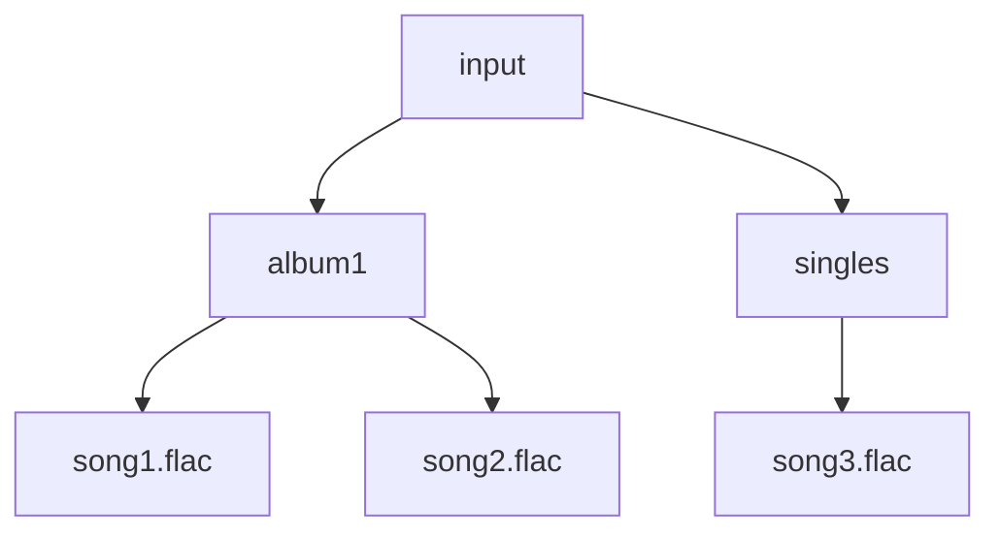
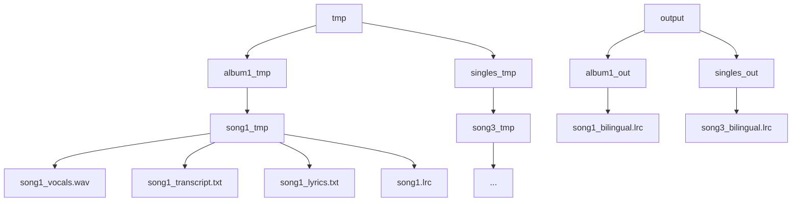

# Batch Processing Orchestrator

## ⚡ Complete Pipeline Orchestration (`process_lyrics.py`)

This module is the main component of the Music Lyrics Processing Pipeline, providing comprehensive batch processing capabilities for entire music libraries. It orchestrates the complete six-stage workflow across multiple files, with sophisticated progress tracking, resume functionality, and detailed reporting.

## Core Functionality

### Primary Purpose
- Orchestrate complete six-stage pipeline for multiple audio files
- Provide comprehensive batch processing with progress tracking
- Implement resume functionality for interrupted processing
- Generate detailed CSV reports with quality metrics

### Key Features
- **Complete Workflow**: Full six-stage pipeline orchestration
- **Recursive Discovery**: Find audio files in nested directory structures
- **Progress Tracking**: Real-time progress indicators and ETA
- **Resume Support**: Continue interrupted processing seamlessly
- **Error Recovery**: Continue processing other files if one fails
- **CSV Reporting**: Detailed processing results and quality metrics

## Complete Processing Workflow

### Stage 1: Metadata Extraction
**Purpose**: Extract song information from audio file tags
- Extract title, artist, album, genre, year, track number
- Fallback to filename parsing if no metadata exists
- Validate essential information for lyrics search

### Stage 2: Vocal Separation
**Purpose**: Isolate vocals from background music using AI
- Use UVR model for high-quality vocal separation
- Save vocals in organized directory structure

### Stage 3: Lyrics Search & Identification
**Purpose**: Find lyrics using metadata and ASR-based song identification
- Fallback to LLM-based song identification from ASR transcripts
- Use web search to identify unknown songs

### Stage 4: ASR Transcription
**Purpose**: Generate timestamped transcripts from isolated vocals
- Transcribe vocals with word-level timestamps
- Generate structured transcript file
- Support resume functionality (skip if exists)

### Stage 5: LRC Generation
**Purpose**: Create synchronized LRC files from lyrics and timestamps
- Combine verified lyrics with ASR timestamps
- Use LLM for intelligent timing alignment
- Generate properly formatted LRC file

### Stage 6: Translation
**Purpose**: Add Traditional Chinese translation to LRC files
- Translate LRC to Traditional Chinese (bilingual output)
- Create synchronized bilingual lyrics
- Preserve timing and formatting

## Batch Processing Architecture

### 1. Recursive File Discovery
- **Multi-Format Support**: Finds FLAC and MP3 files recursively
- **Structure Preservation**: Maintains folder hierarchy in output
- **Smart Filtering**: Identifies audio files by extension
- **Progress Reporting**: Shows discovery results and counts

### 2. Progress Tracking System
- **Real-Time Updates**: Current file being processed
- **Completion Indicators**: Progress percentage and file counts
- **Success Metrics**: Success/failure counting and reporting
- **ETA Calculations**: Estimated time for large batches

### 3. Resume Functionality
- **Checkpoint Detection**: Identifies completed processing stages
- **Skip Logic**: Avoids redundant operations on completed files
- **Partial Resume**: Continues from last completed stage
- **Cache Management**: Preserves intermediate results

### 4. Error Recovery Strategy
- **Individual File Isolation**: One file failure doesn't stop batch
- **Detailed Error Logging**: Comprehensive error reporting
- **Graceful Degradation**: Continues processing other files
- **Result Aggregation**: Collects results from all files

## Directory Structure Management

### Input Structure


### Processing Structure


## Command-Line Interface

### Basic Usage
```bash
# Process all files in input directory
uv run process_lyrics.py

# Custom input directory
uv run process_lyrics.py /path/to/music/library

# Custom output and temp directories
uv run process_lyrics.py /music/input --output-dir /music/output --temp-dir /tmp/lyrics
```

### Resume and Recovery
```bash
# Resume interrupted processing
uv run process_lyrics.py --resume

# Resume with custom directories
uv run process_lyrics.py /music/input --output-dir /music/output --resume

# Force recompute (ignore existing files)
uv run process_lyrics.py --resume --force-recompute
```

### Logging and Reporting
```bash
# Debug mode with detailed logging
uv run process_lyrics.py --log-level DEBUG

# Custom CSV output filename
uv run process_lyrics.py --csv-output my_results.csv

# Disable colored output (for scripts/CI)
uv run process_lyrics.py --no-color

# Combined options
uv run process_lyrics.py /music --output-dir /lyrics --temp-dir /tmp --resume --log-level INFO
```

## Usage Examples

### Basic Batch Processing
```python
from process_lyrics import main

# Process all files in input directory
exit_code = main()
print(f"Processing completed with exit code: {exit_code}")
```

### Large Library Processing
```python
# Process with resume capability for interrupted batches
import sys
sys.argv = ['process_lyrics.py', '--resume', '--log-level', 'INFO']
from process_lyrics import main
exit(main())
```

### Custom Configuration
```python
# Specify custom directories and options
import sys
sys.argv = [
    'process_lyrics.py',
    '/path/to/music/library',
    '--output-dir', '/path/to/lyrics/output',
    '--temp-dir', '/tmp/lyrics_processing',
    '--csv-output', 'processing_results.csv'
]
from process_lyrics import main
exit(main())
```

### Production Deployment
```python
# Process with detailed logging and CSV reporting
import sys
sys.argv = [
    'process_lyrics.py',
    '--log-level', 'INFO',
    '--csv-output', f'results_{datetime.now().strftime("%Y%m%d_%H%M%S")}.csv',
    '--no-color'  # For non-interactive environments
]
from process_lyrics import main
exit(main())
```

### Development and Testing
```python
# Debug mode for troubleshooting issues
import sys
sys.argv = [
    'process_lyrics.py',
    '--log-level', 'DEBUG',
    '--no-color',
    'input'  # Small test directory
]
from process_lyrics import main
exit(main())
```
